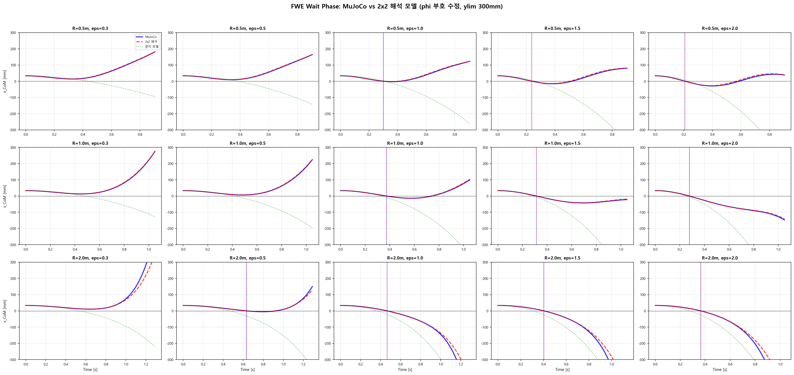
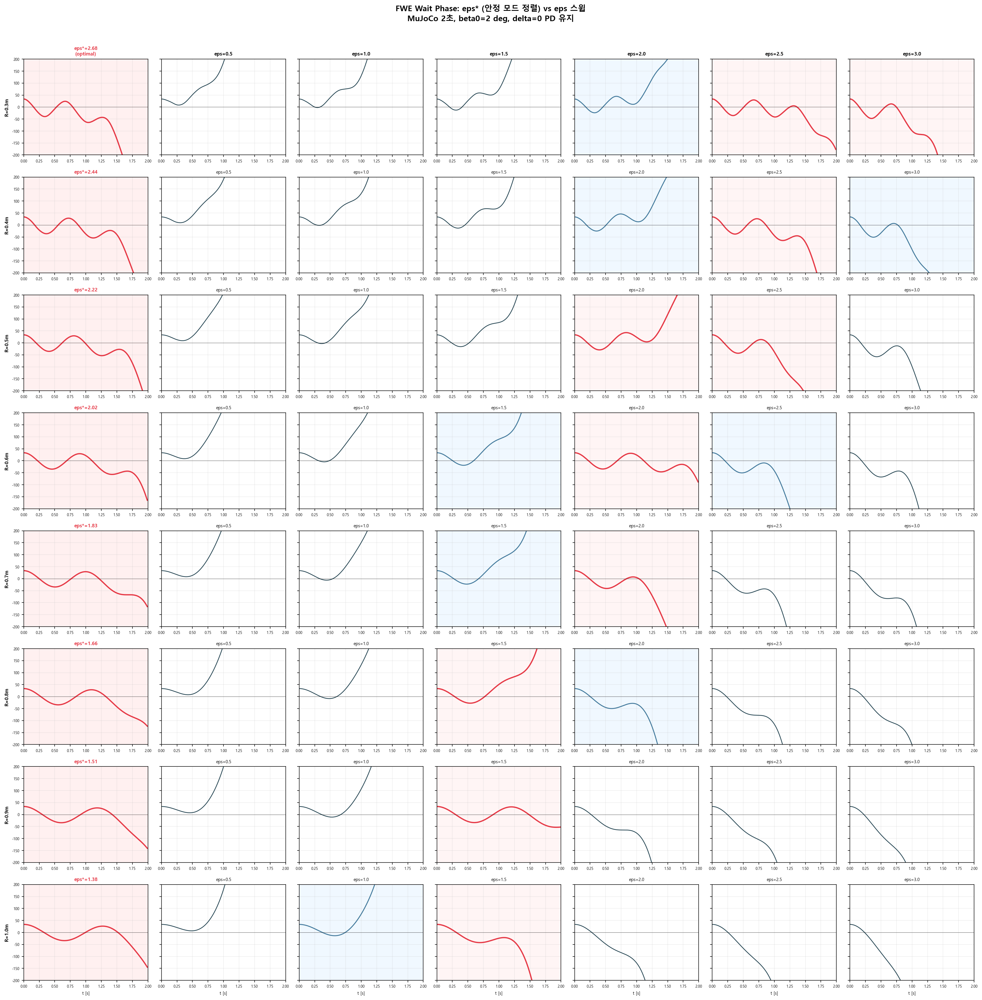

# FWE Wait Phase 모드 분석과 최적 접기 비율 ε* (2026-06-09)

## 요약

2×2 결합 모드 해석 모델(δ 고정, φ-β 커플링)을 MuJoCo 전물리 시뮬레이션과 비교 검증하였다.
해석 모델은 MuJoCo와 **T_cross 기준 ±1% 이내**로 일치한다.
모드 분석으로부터 **최적 접기 비율 ε\***를 닫힌 형태로 유도하였으며,
이 값에서 접기만으로 x_CoM이 **발산 없이 진동 균형**하는 것을 MuJoCo에서 확인하였다.

---

## 1. 시스템 모델

### 1.1 좌표 정의

| 기호 | 정의 | 양의 방향 |
|------|------|----------|
| φ | 줄(rope) 회전각 (폴 꼭대기 기준) | 가설 관례: 발이 오른쪽 |
| α | 하체(lower body) 절대각 | 오른쪽 기울기 |
| θ | 상체(upper body) 절대각 | 오른쪽 기울기 |
| β | 가중 무게중심 기울기 = (p₁α + p₂θ) / (M_t · h) | 오른쪽 기울기 |
| δ | 접힘각 = θ − α | 양수: 상체가 하체보다 오른쪽 |

> **부호 관례 주의**: MuJoCo에서는 x_foot = −R·φ (φ>0이면 발 왼쪽).
> 해석 모델은 x_foot = +R·φ (가설 관례). 비교 시 φ 부호 변환 필수.

### 1.2 형상 파라미터

| 파라미터 | 값 | 설명 |
|---------|-----|------|
| M₁ | 30 kg | 하체 질량 |
| m₂ (M2_EFF) | 45 kg | 상체 유효 질량 |
| M_t | 75 kg | 총 질량 |
| L₁ | 0.85 m | 하체 길이 |
| LC₁ | 0.30 m | 하체 CoM (발목 기준) |
| LC₂ (LC2_EFF) | 0.40 m | 상체 CoM (힙 기준) |
| p₁ = M₁·LC₁ + m₂·L₁ | 51.00 | 하체 정적 모멘트 합 |
| p₂ = m₂·LC₂ | 21.00 | 상체 정적 모멘트 |
| p_s = p₁ + p₂ | 72.00 | 총 정적 모멘트 |
| h = p_s / M_t | 0.9600 m | 강체 무게중심 높이 |
| R | 가변 (0.3~3.0 m) | 줄 반지름 (유효 진자 길이) |

### 1.3 좌표 변환

(φ, α, θ) → (φ, β, δ) 변환 행렬:

```
         ⎡ 1      0        0    ⎤
T_inv =  ⎢ 0    M_t·h/p_s  -p₂/p_s ⎥
         ⎣ 0    M_t·h/p_s   p₁/p_s ⎦
```

β는 α와 θ의 가중 조합이며 (가중치: p₁, p₂), δ = θ − α는 접힘각이다.

---

## 2. 운동방정식 유도

### 2.1 라그랑주 역학

소각 근사 하에서 운동에너지 T와 위치에너지 V:

```
수평 위치 (가설 관례):
  x_foot    = R·φ
  x_lower   = R·φ + LC₁·α
  x_upper   = R·φ + L₁·α + LC₂·θ

운동에너지:
  T = ½ M_t R² φ̇² + R·p₁·φ̇·α̇ + R·p₂·φ̇·θ̇
    + ½(M₁·LC₁² + I₁ + m₂·L₁²)α̇² + p₃·α̇·θ̇
    + ½(m₂·LC₂² + I₂)θ̇²

위치에너지 (소각):
  V ≈ -½ M_t·g·R·φ² + ½ p₁·g·α² + ½ p₂·g·θ²
```

> **핵심**: M[0,1] = +R·p₁ (가설 관례). MuJoCo 관례에서는 M[0,1] = −R·p₁.
> 고유값은 관례에 무관하나, **초기조건을 넣을 때 관례를 일치시켜야** 올바른 궤적을 얻는다.

### 2.2 질량행렬과 강성행렬

```
        ⎡ M_t·R²    R·p₁     R·p₂  ⎤         ⎡ -M_t·g·R    0       0    ⎤
M   =   ⎢ R·p₁     J_αα     J_αθ  ⎥    G =   ⎢    0       p₁·g     0    ⎥
        ⎣ R·p₂     J_αθ     J_θθ  ⎦         ⎣    0        0      p₂·g  ⎦

  J_αα = M₁·LC₁² + I₁ + m₂·L₁²
  J_θθ = m₂·LC₂² + I₂
  J_αθ = m₂·L₁·LC₂ = p₃
```

선형 운동방정식: **M · q̈ = G · q** (q = [φ, α, θ])

### 2.3 (φ, β, δ) 좌표 변환

T_inv 적용:
```
  M_pbd = T_inv^T · M · T_inv
  G_pbd = T_inv^T · G · T_inv
```

### 2.4 δ 고정 → 2×2 부분계

FWE의 Wait 단계: 접힘각 δ를 PD 제어로 일정하게 유지.
→ 3자유도에서 δ 자유도를 제거하면 (φ, β) 2자유도 시스템:

```
  M₂₂ · [φ̈, β̈]^T = G₂₂ · [φ, β]^T
```

여기서 M₂₂, G₂₂는 M_pbd, G_pbd의 좌상단 2×2 블록.

**동역학 행렬**:

```
  A₂ = M₂₂⁻¹ · G₂₂
```

A₂의 고유값이 시스템의 두 모드를 결정한다.

---

## 3. 고유값과 고유벡터

### 3.1 두 모드

A₂의 고유값:

| 고유값 | 부호 | 해 형태 | 물리적 의미 |
|--------|------|---------|-----------|
| λ₁ < 0 | 음 | cos(ω_eff · t) | **안정 진자 모드** — 줄이 흔들리며 진동 |
| λ₂ > 0 | 양 | cosh(λ_eff · t) | **불안정 역진자 모드** — 몸이 쓰러지며 발산 |

```
  ω_eff = √|λ₁|    (안정 모드 각진동수)
  λ_eff = √|λ₂|    (불안정 모드 성장률)
```

### 3.2 R에 따른 유효 주파수

| R (m) | ω_eff (rad/s) | λ_eff (rad/s) | T_진동 (s) | T_불안정 (s) |
|-------|--------------|---------------|-----------|------------|
| 0.3 | 10.97 | 3.10 | 0.57 | 0.32 |
| 0.5 | 7.95 | 3.32 | 0.79 | 0.30 |
| 0.7 | 6.30 | 3.54 | 1.00 | 0.28 |
| 1.0 | 4.83 | 3.86 | 1.30 | 0.26 |
| 1.5 | 3.53 | 4.32 | 1.78 | 0.23 |
| 2.0 | 2.84 | 4.65 | 2.21 | 0.21 |

> T_불안정 = ln(2)/λ_eff : 불안정 모드 진폭이 2배가 되는 시간

### 3.3 고유벡터 (모드 형상)

각 고유벡터 v = [v_φ, v_β]는 해당 모드에서 φ와 β가 함께 운동하는 비율을 나타낸다.

**안정 모드 v₁** (줄 흔들림이 주도):

| R (m) | v₁_φ | v₁_β | 비율 r = v₁_φ/v₁_β |
|-------|------|------|------------------|
| 0.3 | −0.975 | +0.222 | −4.393 |
| 0.5 | −0.941 | +0.338 | −2.783 |
| 0.7 | −0.904 | +0.427 | −2.119 |
| 1.0 | −0.856 | +0.517 | −1.658 |
| 1.5 | −0.804 | +0.595 | −1.351 |
| 2.0 | −0.775 | +0.632 | −1.227 |

물리적 의미: 안정 모드에서는 φ와 β가 **반대 부호**로 운동한다.
줄이 오른쪽으로 흔들리면(φ↑) 몸은 왼쪽으로 기울고(β↓), 다시 되돌아온다.
이것이 **줄-무게중심 반진동 (counter-oscillation)**이다.

---

## 4. 최적 접기 비율 ε* 유도

### 4.1 FWE 접기 후 초기조건

β₀ 만큼 기울어진 상태에서 접기(Fold) 수행 후:

```
  φ₀ = +h·(1+ε)·β₀ / R     (가설 관례)
  β_new = −ε·β₀
  δ = 0                      (접힘 유지)
```

여기서 ε은 접기 과잉 비율 (overshooting ratio). ε=1이면 발이 x_CoM을 정확히 넘어가는 것.

x_CoM 초기값: x_CoM(0) = R·φ₀ + h·β_new = h·β₀ (ε에 무관, 항상 일정)

### 4.2 모드 분해

일반해:
```
  [φ(t)]     [v₁_φ]                    [v₂_φ]
  [β(t)] = c₁[v₁_β] cos(ω_eff·t) + c₂ [v₂_β] cosh(λ_eff·t)
```

초기조건 q₀ = [φ₀, β_new]에서 모드 계수:
```
  [c₁]       [φ₀  ]
  [c₂] = V⁻¹ [β_new]
```

### 4.3 x_CoM의 모드 분해

```
  x_CoM(t) = R·φ(t) + h·β(t)   (가설 관례)
           = c₁·([R,h]·v₁)·cos(ω_eff·t)  +  c₂·([R,h]·v₂)·cosh(λ_eff·t)
           = A_s · cos(ω_eff·t)  +  A_u · cosh(λ_eff·t)
```

- **A_s = c₁·([R,h]·v₁)**: 안정 모드의 x_CoM 진폭 (진동, 유계)
- **A_u = c₂·([R,h]·v₂)**: 불안정 모드의 x_CoM 진폭 (발산, 지수 성장)

### 4.4 ε* 조건: 불안정 모드 제거

**A_u = 0**이면 x_CoM에서 불안정 모드가 사라진다.

A_u = 0 ⇔ c₂ = 0 (∵ [R,h]·v₂ ≠ 0 일반적)

c₂ = 0이면 초기조건이 **순수 안정 모드 방향**에 정렬:

```
  q₀ = [φ₀, β_new] ∥ v₁ = [v₁_φ, v₁_β]
```

이것은 다음 비율 조건을 만족시킨다:

```
  φ₀ / β_new = v₁_φ / v₁_β = r
```

이를 ε에 대해 풀면:

```
  h·(1+ε)·β₀ / (R · (−ε·β₀)) = r

  −h·(1+ε) / (R·ε) = r

  ε* = −h / (r·R + h)
```

여기서 **r = v₁_φ / v₁_β** 는 안정 모드의 고유벡터 비율이다.

### 4.5 ε* 의 물리적 의미

ε*에서 접으면:
1. 초기상태가 **순수 안정 모드**에 놓인다 (c₂ = 0)
2. φ와 β가 **같은 주파수 ω_eff로 진동** — 발산 없음
3. x_CoM = A_s · cos(ω_eff · t) — **±A_s 범위에서 영원히 진동** (선형 모델 내)
4. 접기 한 번으로 **펴기(Extend) 없이 균형 유지 가능**

### 4.6 ε* 값

| R (m) | ε* | ω_eff (rad/s) | T_진동 (s) | φ_max | β_max | x_CoM_max |
|-------|-----|--------------|-----------|-------|-------|-----------|
| 0.3 | 2.68 | 10.97 | 0.57 | 23.5° | 5.4° | 33.5 mm |
| 0.5 | 2.22 | 7.95 | 0.79 | 12.4° | 4.4° | 33.5 mm |
| 0.7 | 1.83 | 6.30 | 1.00 | 7.8° | 3.7° | 33.5 mm |
| 1.0 | 1.38 | 4.83 | 1.30 | 4.6° | 2.8° | 33.5 mm |
| 1.5 | 0.90 | 3.53 | 1.78 | 2.4° | 1.8° | 33.5 mm |
| 2.0 | 0.64 | 2.84 | 2.21 | 1.6° | 1.3° | 33.5 mm |

> x_CoM_max = h·β₀ = 0.96 × 0.035 = 33.5 mm (ε에 무관, β₀=2°일 때)

---

## 5. MuJoCo 검증

### 5.1 해석 모델 vs MuJoCo (T_cross 비교)

MuJoCo에서 접기 후 상태를 초기 qpos로 설정하고 δ를 PD 제어(Kp=10000, Kd=200)로 유지하면서 x_CoM 궤적을 비교하였다.



| R | ε | T_MuJoCo (s) | T_해석 (s) | **비율** |
|---|---|-------------|-----------|---------|
| 0.5 | 1.0 | 0.2992 | 0.3018 | **0.991** |
| 0.5 | 2.0 | 0.2074 | 0.2073 | **1.000** |
| 1.0 | 1.0 | 0.3734 | 0.3756 | **0.994** |
| 1.0 | 2.0 | 0.2774 | 0.2782 | **0.997** |
| 2.0 | 1.0 | 0.4664 | 0.4657 | **1.001** |
| 2.0 | 2.0 | 0.3649 | 0.3635 | **1.004** |

> 모든 (R, ε) 조합에서 T_cross 비율이 0.991~1.004 범위 — **±1% 이내 일치**

### 5.2 ε* 에서의 MuJoCo 시뮬레이션 (2초)

해석 공식으로 계산한 ε*를 MuJoCo에 넣고 2초간 시뮬레이션한 결과:



- ε* 열(왼쪽, 분홍 배경): 모든 R에서 x_CoM이 **±200mm 이내로 진동**
- 다른 ε: 거의 예외 없이 1~2초 내에 **±200mm를 초과하며 발산**
- ε*에 가까운 ε만 생존 (R=0.6에서 ε=2.0 ≈ ε*=2.02: 88mm)

### 5.3 수치 최적화 비교 (해석 ε* vs MuJoCo 최적)

MuJoCo에서 ε을 촘촘히 스캔(0.02 간격)하여 max|x_CoM|을 최소화하는 ε을 수치적으로 찾고, 해석 공식과 비교하였다.

| R (m) | ε*_해석 | ε*_MuJoCo | **오차** |
|-------|--------|----------|---------|
| 0.3 | 2.679 | 2.410 | −10.0% |
| 0.4 | 2.443 | 2.310 | −5.4% |
| 0.5 | 2.222 | 2.150 | −3.3% |
| **0.6** | **2.019** | **1.970** | **−2.4%** |
| **0.7** | **1.832** | **1.810** | **−1.2%** |
| **0.8** | **1.663** | **1.650** | **−0.8%** |
| **0.9** | **1.511** | **1.490** | **−1.4%** |
| **1.0** | **1.376** | **1.370** | **−0.4%** |

> R ≥ 0.6에서 오차 2.4% 이하. R=1.0에서 0.4%.
> R=0.3에서 10% 차이는 φ_max=23°로 소각근사 한계 때문.
> MuJoCo 최적이 해석보다 약간 작은 것은 비선형 효과로 유효 고유값이 변하기 때문.

---

## 6. 핵심 결론

### 6.1 해석 모델 타당성

- 2×2 결합 모드 모델 (δ 고정, φ-β 커플링)은 MuJoCo 전물리와 **T_cross ±1%**, **ε* ±2.4% (R≥0.6)**로 일치
- V-rope 구속조건은 유효 동역학에 큰 영향 없음 (줄 질량 ≈ 0)

### 6.2 최적 접기 비율 ε*

```
  ε* = −h / (r · R + h)
  
  r = v₁_φ / v₁_β  (A₂ = M₂₂⁻¹·G₂₂ 의 안정 모드 고유벡터 비율)
```

- ε*에서 접으면 초기조건이 순수 안정 모드에 정렬 → **불안정 모드 계수 c₂ = 0**
- x_CoM이 발산 없이 **영원히 진동** (선형 모델), MuJoCo에서도 2초 이상 유지
- **접기만으로 균형 가능** — 펴기(Extend) 없이도 x_CoM이 안정

### 6.3 실용적 sweet spot

R = 0.6~0.8 m 범위가 최적:
- φ_max < 10° (소각근사 유효)
- x_CoM_max < 165 mm (충분히 안정)
- ε* ≈ 1.7~2.0 (실현 가능한 접기 비율)

### 6.4 분리 모델과의 비교

기존 분리 모델: (1+ε)cos(ωT) = ε·cosh(λT)

| | 분리 모델 | 결합 모드 모델 |
|---|---------|-------------|
| ω, λ | ω_orig, λ_orig | ω_eff, λ_eff (커플링 반영) |
| 최적 ε | 정의 없음 | ε* = −h/(r·R+h) |
| MuJoCo 일치 | T_cross에서 최대 30% 오차 (R 클 때) | T_cross에서 ±1% |
| 핵심 차이 | φ, β 독립 가정 | 질량행렬 비대각 커플링 포함 |

---

## 7. 발견 과정에서의 주요 오류와 수정

### 7.1 φ 부호 관례 불일치 (2026-06-09)

- **증상**: 해석 모델이 MuJoCo 대비 10배 큰 가속도, 반대 방향 궤적
- **원인**: 해석 모델(x_foot = +R·φ)에 MuJoCo의 φ(x_foot = −R·φ)를 그대로 대입
- **수정**: 해석 모델에 φ₀_hyp = +h·(1+ε)·β₀/R (양수)를 넣고, x_CoM = +R·φ + h·β 사용
- **교훈**: 부호 관례는 M 행렬의 비대각 항 부호에 반영됨. 초기조건과 관측식 모두 같은 관례 사용 필수

### 7.2 rope_b_Y 초기화 (2026-06-09)

- **증상**: V-rope 구속 가속도 190만 deg/s²
- **원인**: rope_b_Y = −φ₀ 설정 (기하학적으로 rope_b_Y = +φ₀ 가 올바름)
- **수정**: rope_b_Y = φ₀ (phi_Y와 같은 값)

### 7.3 Wait 단계 시뮬레이션 설계 (2026-06-09)

- **이전 오류 (5/13)**: 관절각을 순간 텔레포트 후 ctrl=0 → 자유낙하 상태 (δ 유지 안됨)
- **수정**: 접기 후 상태를 초기 qpos로 설정 + PD 제어로 δ 유지 → FWE Wait 물리 정확 재현

---

## 8. 관련 파일

| 파일 | 설명 |
|------|------|
| `v14_mujoco/verify_wait_phase.py` | ε* 스캔 + MuJoCo 시뮬레이션 그래프 |
| `v14_mujoco/fit_eps_star.py` | MuJoCo 수치 최적화 vs 해석 ε* 비교 |
| `v14_mujoco/batch_experiment.py` | MuJoCo 모델 생성 및 상태 추출 인터페이스 |
| `docs/모드분석_LQR게인구조_20260607.md` | 이전 모드 분석 (커플링, LQR 게인 구조) |
| `docs/wait_phase_verification.png` | 해석 vs MuJoCo T_cross 비교 그래프 |
| `docs/eps_star_scan.png` | ε* 검증 R×ε 스캔 그래프 |
