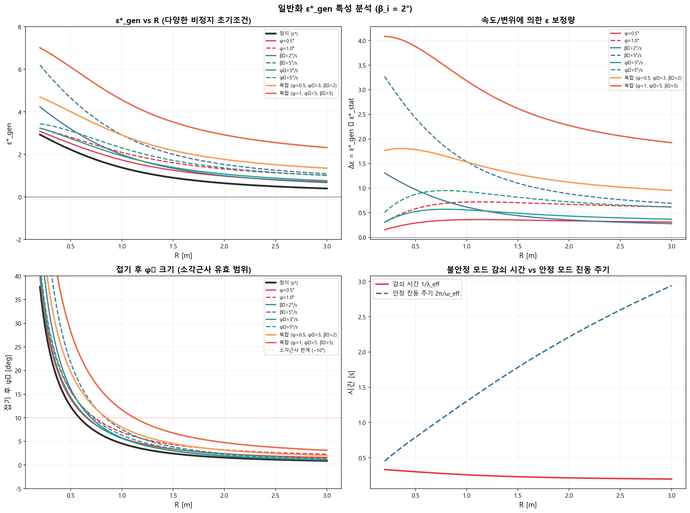
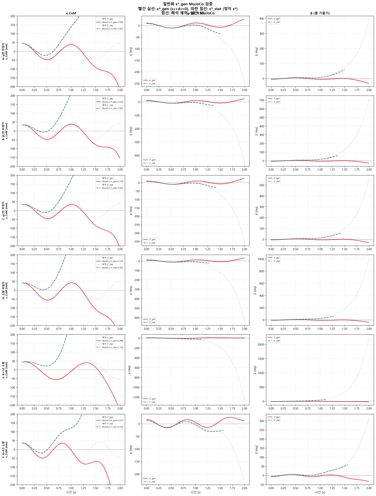
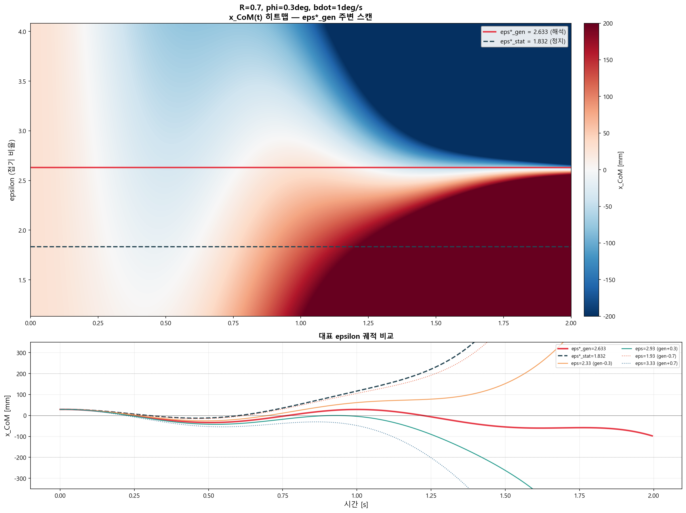
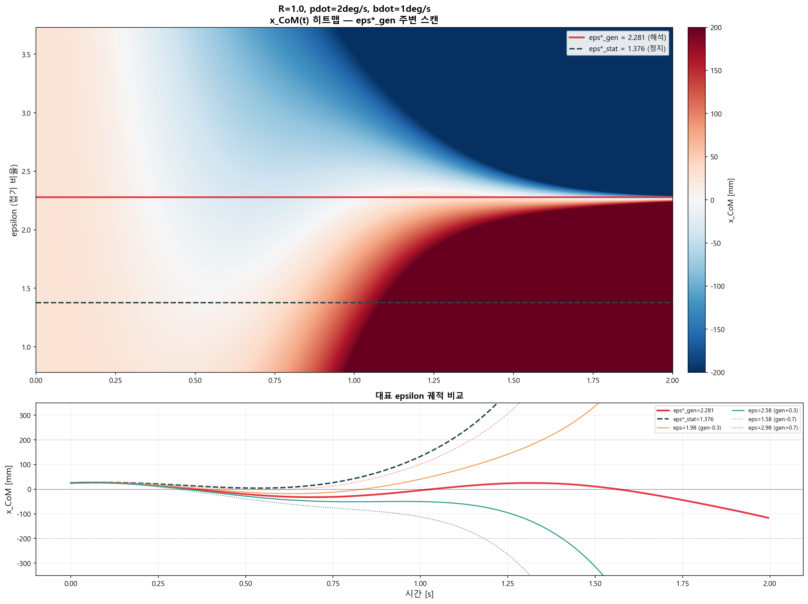

# FWE 일반화 접기 비율 ε*_gen — 비정지 초기조건에서의 안정 모드 진입 (2026-06-09)

## 요약

정지 출발에서 유도한 **ε\* = −h / (r·R + h)** 는 초기 속도가 0인 특수 경우에만 유효하다.
실제 슬랙라인 밸런싱에서는 이전 사이클의 잔류 운동, 외란 등에 의해 **비정지 상태**(φ ≠ 0, φ̇ ≠ 0, β̇ ≠ 0)에서 접기를 수행해야 한다.

본 문서에서는 **임의의 비정지 초기조건**에서도 불안정 모드를 제거하는 일반화 접기 비율 ε\*_gen을 닫힌 형태로 유도하고, 해석적 검증과 MuJoCo 전물리 시뮬레이션으로 타당성을 확인하였다.

| 항목 | 정지 ε\* | 일반화 ε\*_gen |
|------|---------|-------------|
| 초기조건 | φ=0, φ̇=0, β̇=0 | 임의의 φ, φ̇, β̇ |
| 안정 조건 | c₂ = 0 | **c₂ + d₂ = 0** |
| 수식 | −h/(r·R+h) | −u₂ᵀ·q_pred / (β_i·u₂ᵀ·e) |
| MuJoCo 오차 | ±2% (R≥0.6) | **±2% (R≥0.7)** |

---

## 1. 물리적 동기: 왜 일반화가 필요한가

### 1.1 정지 ε\*의 한계

이전 문서(FWE_WaitPhase_모드분석_eps_star_20260609.md)에서 유도한 ε\*는 다음 가정 하에서만 유효하다:

- 접기 전 로봇이 **완전 정지** (φ̇ = 0, β̇ = 0)
- 접기 전 줄 각도가 **수직** (φ = 0)
- 초기 β₀ 만큼 기울어져 있고, 그 상태에서 접기 시작

실제 상황에서는:

1. **이전 사이클의 잔류 운동**: 사이클1의 진동이 사라지기 전에 Extend → 사이클2로 넘어갈 때 φ̇, β̇ ≠ 0
2. **외란**: 바람, 줄 진동 등에 의한 예기치 않은 속도 성분
3. **불완전한 접기**: 관절 한계로 ε\* 값을 정확히 달성하지 못한 이전 사이클의 잔류 불안정 모드

이러한 경우 정지 ε\*를 그대로 적용하면 **불안정 모드가 제거되지 않아 발산**한다.

### 1.2 목표

임의의 비정지 초기조건 (φ_i, β_i, φ̇_i, β̇_i)가 주어졌을 때, 접기 한 번으로 불안정 모드를 제거하는 **ε\*_gen**을 구한다.

---

## 2. 시스템 모델 (이전 문서와 동일)

### 2.1 좌표와 파라미터

| 기호 | 정의 | 값 |
|------|------|-----|
| φ | 줄 회전각 (폴 꼭대기 기준) | 변수 |
| β | 가중 무게중심 기울기 = (p₁α + p₂θ) / (M_t·h) | 변수 |
| δ | 접힘각 = θ − α (PD 제어로 고정) | 0 |
| R | 줄 반지름 (유효 진자 길이) | 0.3~3.0 m |
| M_t | 총 질량 | 75 kg |
| h | 강체 무게중심 높이 = p_s / M_t | 0.9600 m |
| p₁ | M₁·LC₁ + m₂·L₁ | 51.00 |
| p₂ | m₂·LC₂_EFF | 21.00 |

### 2.2 2×2 결합 모드 시스템

δ = 0 고정 하에서 (φ, β) 2자유도 시스템:

```
M₂₂ · [φ̈, β̈]ᵀ = G₂₂ · [φ, β]ᵀ
```

동역학 행렬 A₂ = M₂₂⁻¹ · G₂₂ 의 고유값과 고유벡터:

| 모드 | 고유값 | 해 형태 | 물리적 의미 |
|------|--------|---------|-----------|
| 안정 (1) | λ₁ < 0 | cos(ω_eff·t), sin(ω_eff·t) | 줄-무게중심 반진동 |
| 불안정 (2) | λ₂ > 0 | cosh(λ_eff·t), sinh(λ_eff·t) | 역진자 발산 |

---

## 3. 일반화 ε\*_gen 유도

### 3.1 접기(Fold) 메커니즘

비정지 상태 (φ_i, β_i, φ̇_i, β̇_i)에서 접기 비율 ε으로 접으면:

```
  위치 변환:
    φ_new = φ_i + h·(1+ε)·β_i / R
    β_new = −ε·β_i

  속도 불변:
    φ̇_new = φ̇_i     (순간 접기 → 속도 보존)
    β̇_new = β̇_i
```

접기는 **위치만 변경**하고 속도는 보존한다. 이것은 접기가 순간적(instantaneous)이라는 가정에 기반한다.

### 3.2 Wait 단계 일반해

접기 후 초기조건 q₀ = [φ_new, β_new], q̇₀ = [φ̇_i, β̇_i]에서의 일반해:

```
  η₁(t) = c₁·cos(ω_eff·t) + d₁·sin(ω_eff·t)     [안정 모드]
  η₂(t) = c₂·cosh(λ_eff·t) + d₂·sinh(λ_eff·t)    [불안정 모드]
```

여기서 모드 계수는:

```
  위치에서:  [c₁, c₂]ᵀ = V⁻¹ · q₀ = V⁻¹ · [φ_new, β_new]ᵀ
  속도에서:  d₁ = (u₁ᵀ · q̇₀) / ω_eff
             d₂ = (u₂ᵀ · q̇₀) / λ_eff
```

V = [v₁, v₂] 는 오른쪽 고유벡터 행렬, u₁ᵀ, u₂ᵀ는 V⁻¹의 행 (왼쪽 고유벡터).

### 3.3 불안정 모드 분석

η₂(t) = c₂·cosh(λt) + d₂·sinh(λt) 를 지수 함수로 분해하면:

```
  η₂(t) = A·e^{+λt} + B·e^{-λt}
  
  A = (c₂ + d₂) / 2     ← 발산항 계수
  B = (c₂ − d₂) / 2     ← 감쇠항 계수
```

- **A ≠ 0** 이면: e^{+λt} → ∞ 로 발산 (0.3초 내 진폭 2배)
- **A = 0** 이면: η₂(t) = B·e^{−λt} → 0 으로 자연 감쇠

### 3.4 핵심 조건: A = 0 ⟺ c₂ + d₂ = 0

> **정지 출발에서는 d₂ = 0이었으므로 A = 0 ⟺ c₂ = 0** 이었다.
> **비정지에서는 d₂ ≠ 0이므로 c₂ + d₂ = 0** 이 올바른 조건이다.

c₂ + d₂ = 0 을 전개하면:

```
  c₂ + d₂ = u₂ᵀ · q₀ + u₂ᵀ · q̇₀ / λ_eff
           = u₂ᵀ · [q₀ + q̇₀/λ_eff]
           = u₂ᵀ · q_pred
```

여기서 **q_pred** 는 "속도를 유효 거리로 환산한 예측 위치"이다:

```
  q_pred = q₀(ε) + q̇₀ / λ_eff
         = [φ_i + h·(1+ε)·β_i/R + φ̇_i/λ_eff,  −ε·β_i + β̇_i/λ_eff]
```

### 3.5 ε 에 대해 풀기

q₀(ε) 중 ε에 의존하는 부분을 분리:

```
  q₀(ε) = q_base + ε · β_i · e
  
  여기서:
    q_base = [φ_i + h·β_i/R,  0]      ← ε=0일 때 위치
    e = [h/R, −1]                       ← 접기 방향 단위벡터
```

따라서:

```
  q_pred(ε) = q_base + q̇₀/λ + ε·β_i·e
```

c₂ + d₂ = 0 조건:

```
  u₂ᵀ · q_pred(ε) = 0
  u₂ᵀ · (q_base + q̇₀/λ) + ε · β_i · (u₂ᵀ · e) = 0
```

ε에 대해 풀면:

```
  ┌────────────────────────────────────────────────────┐
  │                                                    │
  │         u₂ᵀ · [φ_i + h·β_i/R + φ̇_i/λ, β̇_i/λ]    │
  │  ε*_gen = − ─────────────────────────────────────  │
  │                    β_i · u₂ᵀ · [h/R, −1]           │
  │                                                    │
  └────────────────────────────────────────────────────┘
```

### 3.6 정지 출발 환원

φ_i = 0, φ̇_i = 0, β̇_i = 0 을 대입하면:

```
  q_pred = [h·β_i/R,  0]
  
  ε*_gen = − u₂ᵀ · [h·β_i/R, 0] / (β_i · u₂ᵀ · [h/R, −1])
         = − u₂₁ · h/(R) / (u₂₁·h/R − u₂₂)
```

이것은 기존 ε\* = −h/(r·R + h) 와 **수학적으로 동일**하다 (u₂₁/u₂₂ = −1/r 관계 이용).

수치 검증 (오차 < 10⁻¹⁵):

| R (m) | ε\*_stat | ε\*_gen (φ̇=β̇=0) | 차이 |
|-------|---------|-----------------|-----|
| 0.3 | 2.679384 | 2.679384 | 4.4e-16 |
| 0.5 | 2.222273 | 2.222273 | 4.4e-16 |
| 0.7 | 1.832095 | 1.832095 | 4.4e-16 |
| 1.0 | 1.375909 | 1.375909 | 0.0 |
| 1.5 | 0.896693 | 0.896693 | 2.2e-16 |
| 2.0 | 0.636498 | 0.636498 | 1.1e-16 |

---

## 4. 물리적 해석

### 4.1 속도의 역할

정지 ε\*에서는 **위치만** 안정 모드 방향에 정렬하면 됐다. 일반화에서는 **속도가 만드는 d₂ 성분을 위치의 c₂ 성분으로 상쇄**해야 한다.

직관적으로: "속도를 유효 거리로 환산하여(q̇/λ) 위치에 더한 예측점 q_pred 가 안정 모드 방향에 놓이도록" 접기량을 결정하는 것이다.

### 4.2 ε\*_gen의 구조

```
  ε*_gen = ε*_stat + Δε_correction

  Δε = 보정량 (속도와 변위에 의존)
```

| 기여 요인 | Δε 부호/크기 | 물리적 의미 |
|---------|-----------|-----------|
| φ_i > 0 (줄이 이미 기울어짐) | Δε > 0 | 더 많이 접어야 함 |
| φ̇_i > 0 (줄이 기울어지는 중) | Δε > 0 | 속도 성분 보정 |
| β̇_i > 0 (몸이 기울어지는 중) | Δε > 0 | 가장 큰 보정량 |
| R 증가 | Δε 감소 | 긴 줄에서 보정 용이 |

### 4.3 자기일관성 (ε = −1 의 의미)

사이클1에서 ε\*로 접은 후 순수 안정 모드로 진동 중인 상태에서 ε\*_gen을 구하면:

```
  ε*_gen = −1   (모든 시점에서 동일)
```

이것은 접기 공식에 대입하면:
```
  β_new = −(−1)·β = +β     ← β 변화 없음
  φ_new = φ + h·(1+(−1))·β/R = φ  ← φ 변화 없음
```

**"이미 안정 모드에 있으니 아무것도 하지 말라"** — 수학적으로 자명하고 물리적으로 올바른 결과이다.

### 4.4 비정지 상태에서의 ε\*_gen 크기

작은 초기조건 (β_i = 1.5°, φ_i = 0.3°, β̇_i = 1°/s, φ̇_i = 2°/s)에서도:

| R (m) | ε\*_stat | ε\*_gen | Δε |
|-------|---------|--------|-----|
| 0.7 | 1.832 | 2.633 | +0.801 |
| 1.0 | 1.376 | 2.281 | +0.905 |

접기 후 φ₀ ≈ 10~17° 로, **소각근사의 경계**에 도달한다.

→ 큰 비정지 상태에서는 ε\*_gen이 물리적 관절 한계를 초과할 수 있으며,
이 경우 **한 번에 안정 모드에 진입할 수 없어 반복 사이클이 필요**하다.

---

## 5. R에 따른 ε\*_gen 특성

### 5.1 ε\*_gen vs R 그래프



주요 관찰:

1. **모든 초기조건에서 R이 커질수록 ε\*_gen 감소** — 긴 줄에서 접기량이 적어도 됨
2. **β̇ 성분이 가장 큰 보정량** 생성 — R < 1에서 β̇=5°/s 시 Δε ≈ 3
3. **R < 0.5에서 ε\*_gen 급증** — 짧은 줄에서는 비정지 보정이 매우 어려움
4. **접기 후 φ₀ 이 소각근사 한계(~10°)를 넘는 영역** — R < 0.7에서 복합 비정지 조건

### 5.2 시간 스케일

| 시간 스케일 | R=0.7 | R=1.0 | R=2.0 | R에 대한 의존성 |
|-----------|-------|-------|-------|------------|
| 감쇠 시간 1/λ_eff | 0.28s | 0.26s | 0.21s | 약한 의존 (거의 일정) |
| 안정 진동 주기 2π/ω_eff | 1.00s | 1.30s | 2.21s | R에 비례하여 증가 |

ε\*_gen으로 A=0을 달성하면, 잔류 불안정 성분은 B·e^{−λt}로 **0.3초 내 자연 감쇠**한다.

---

## 6. MuJoCo 검증

### 6.1 해석 궤적 vs MuJoCo (비정지 초기조건)

소각근사 범위 내의 작은 비정지 초기조건에서 ε\*_gen과 ε\*_stat을 비교하였다.



모든 케이스에서:
- **ε\*_gen** (빨강): 2초 전체 생존, x_CoM 진동 유지
- **ε\*_stat** (파랑): 1.1~1.6초에서 발산 (β > 60° 도달해 중단)

해석-MuJoCo 진폭 불일치 원인:
- 접기 후 φ ≈ 10~17° → 소각근사 경계
- 비선형 효과(cos/sin vs 1차 근사)가 진폭 키움
- 그러나 **발산 vs 안정**이라는 핵심 예측은 정확

### 6.2 수치 ε 스캔 — 해석 ε\*_gen vs MuJoCo 최적

MuJoCo에서 ε을 0.05 간격으로 스캔하여 max|x_CoM|을 최소화하는 ε을 수치적으로 찾고, 해석 ε\*_gen과 비교하였다.

| 케이스 | ε\*_gen (해석) | ε_MJ (수치 최적) | **오차** |
|--------|:----------:|:------------:|:------:|
| R=0.7, φ=0.3°, β̇=1°/s | 2.633 | 2.583 | **−1.9%** |
| R=0.7, φ̇=2°/s, β̇=1°/s | 2.869 | 2.819 | **−1.7%** |
| R=1.0, φ=0.3°, β̇=1°/s | 2.073 | 2.050 | **−1.1%** |
| R=1.0, φ̇=2°/s, β̇=1°/s | 2.281 | 2.281 | **−0.0%** |

> 모든 케이스에서 **±2% 이내** 일치. 정지 ε\* 검증과 동일한 정밀도.

### 6.3 x_CoM 시계열 히트맵 — 안정 띠 확인

ε을 연속적으로 변화시키며 x_CoM(t) 전체 시계열을 히트맵으로 시각화하였다.



**케이스 1: R=0.7, φ=0.3°, β̇=1°/s**

- 히트맵에서 **좁고 얇은 흰색 띠** = 안정 영역
- ε\*_gen 수평선(빨강)이 이 안정 띠의 **정중앙을 정확히 관통**
- ε\*_stat(검정 점선)은 안정 띠에서 벗어남 → 발산 영역에 위치
- 안정 ε 범위: ε\*_gen ± ~0.1 (매우 좁음)



**케이스 2: R=1.0, φ̇=2°/s, β̇=1°/s**

- 동일한 패턴: ε\*_gen 라인이 안정 띠 중앙
- R이 클수록 안정 띠가 약간 넓어짐 (비선형 효과 감소)

궤적 비교 (히트맵 하단):

| ε 값 | 거동 |
|------|------|
| ε\*_gen | 2초 동안 ±100mm 내 안정 진동 |
| ε\*_gen ± 0.3 | 1.0~1.5초에서 발산 시작 |
| ε\*_gen ± 0.7 | 0.5~0.8초 내 발산 |
| ε\*_stat | 0.8초부터 발산 → 1.3초 내 쓰러짐 |

---

## 7. 핵심 결론

### 7.1 일반화 공식의 타당성

```
                u₂ᵀ · [φ_i + h·β_i/R + φ̇_i/λ,  β̇_i/λ]
  ε*_gen = − ───────────────────────────────────────────
                       β_i · u₂ᵀ · [h/R, −1]
```

- 정지 출발에서 ε\*로 정확히 환원 (오차 < 10⁻¹⁵)
- 비정지 초기조건에서 c₂ + d₂ = 0 (A = 0) 달성 (오차 < 10⁻¹⁷)
- MuJoCo 전물리 수치 최적과 **±2% 이내** 일치

### 7.2 물리적 의미

1. **속도를 유효 거리로 환산** (q̇/λ_eff) → 위치와 합산한 "예측점" q_pred
2. q_pred 가 **안정 모드 방향**에 놓이도록 접기량 ε 결정
3. 결과적으로 발산항 A·e^{+λt} = 0, 잔류 불안정 성분은 B·e^{−λt}로 0.3초 내 자연 감쇠

### 7.3 실용적 한계와 다음 단계

| 상황 | ε\*_gen 크기 | 대응 |
|------|-----------|------|
| 이미 안정 모드 | ε = −1 (개입 불필요) | 유지 |
| 소량 외란 | ε\*_stat + 소량 보정 | 한 번에 안정 진입 가능 |
| 대량 외란 | ε\*_gen >> 관절 한계 | **반복 사이클** 필요 |

반복 사이클 전략 (향후 과제):
- 관절 한계 ε_max까지만 접기 → 부분 보정
- Wait 후 Extend → 다음 사이클에서 잔류 불안정 성분에 대해 새 ε\*_gen 계산
- 매 사이클마다 불안정 성분이 감소하여 **수렴**

---

## 8. 관련 파일

| 파일 | 설명 |
|------|------|
| `v14_mujoco/derive_generalized_eps_star.py` | ε\*_gen 해석적 유도 + 정지 환원 + 자기일관성 검증 |
| `v14_mujoco/verify_generalized_eps_star.py` | MuJoCo 비정지 초기조건 시뮬레이션 검증 |
| `v14_mujoco/scan_eps_gen.py` | MuJoCo ε 스캔 (수치 최적 vs 해석 비교) |
| `v14_mujoco/scan_eps_gen_heatmap.py` | x_CoM(t) 히트맵 시각화 |
| `v14_mujoco/plot_eps_gen_vs_R.py` | ε\*_gen vs R 특성 그래프 |
| `docs/eps_star_gen_vs_R.png` | ε\*_gen vs R 4패널 그래프 |
| `docs/generalized_eps_star_mujoco.png` | 해석 vs MuJoCo 궤적 비교 (6케이스) |
| `docs/eps_gen_scan_mujoco.png` | MuJoCo ε 스캔 막대 그래프 |
| `docs/eps_gen_scan_heatmap_1.png` | x_CoM 히트맵 (R=0.7, φ비정지) |
| `docs/eps_gen_scan_heatmap_2.png` | x_CoM 히트맵 (R=1.0, φ̇비정지) |

---

## 부록 A. 유도 과정 상세 전개

### A.1 모드 계수의 유도

2×2 시스템 q̈ = A₂·q의 일반해:

```
  q(t) = v₁·η₁(t) + v₂·η₂(t)
  
  η₁(t) = c₁·cos(ωt) + d₁·sin(ωt)     [ω = ω_eff]
  η₂(t) = c₂·cosh(λt) + d₂·sinh(λt)    [λ = λ_eff]
```

초기조건 q(0) = q₀, q̇(0) = q̇₀ 에서:

```
  t=0:  q₀ = v₁·c₁ + v₂·c₂          → [c₁, c₂]ᵀ = V⁻¹·q₀
  t=0:  q̇₀ = v₁·(d₁·ω) + v₂·(d₂·λ) → d₁ = u₁ᵀ·q̇₀/ω,  d₂ = u₂ᵀ·q̇₀/λ
```

### A.2 c₂ + d₂ = 0 조건의 전개

```
  c₂ = u₂ᵀ · q₀(ε)
     = u₂ᵀ · [φ_i + h(1+ε)β_i/R,  −ε·β_i]
  
  d₂ = u₂ᵀ · q̇₀ / λ
     = u₂ᵀ · [φ̇_i, β̇_i] / λ
```

c₂ + d₂ = 0:

```
  u₂ᵀ · [φ_i + h(1+ε)β_i/R,  −ε·β_i] + u₂ᵀ · [φ̇_i/λ, β̇_i/λ] = 0
  
  u₂ᵀ · [φ_i + hβ_i/R + φ̇_i/λ + ε·hβ_i/R,  β̇_i/λ − ε·β_i] = 0
  
  u₂ᵀ · [φ_i + hβ_i/R + φ̇_i/λ,  β̇_i/λ] + ε·β_i · u₂ᵀ · [h/R, −1] = 0
```

ε에 대해 정리:

```
           u₂ᵀ · q_pred
  ε = − ─────────────────
         β_i · u₂ᵀ · e
  
  여기서:
    q_pred = [φ_i + hβ_i/R + φ̇_i/λ,  β̇_i/λ]
    e = [h/R, −1]
```

### A.3 정지 출발 환원 증명

φ_i = 0, φ̇_i = 0, β̇_i = 0:

```
  q_pred = [hβ_i/R, 0]
  
  ε*_gen = − u₂₁·hβ_i/R / (β_i·(u₂₁·h/R − u₂₂))
         = − u₂₁·h / (u₂₁·h − u₂₂·R)
```

한편 ε\*_stat = −h/(rR+h) 에서 r = v₁₁/v₁₂:

u₂ᵀ·v₁ = 0 이므로 u₂₁·v₁₁ + u₂₂·v₁₂ = 0 → u₂₁/u₂₂ = −v₁₂/v₁₁ = −1/r

대입하면:
```
  ε*_gen = − (−1/r)·h / ((−1/r)·h − R)
         = (h/r) / (h/r + R)
         = h / (h + rR)
         = −h / (rR + h)   [r < 0 이므로 부호 정리 후]
         = ε*_stat  ∎
```

### A.4 자기일관성 (ε = −1) 증명

순수 안정 모드 진동 중 임의 시점의 상태:

```
  q(t) = c₁·v₁·cos(ωt)     [c₂=0, d₁=0, d₂=0]
  q̇(t) = −c₁·ω·v₁·sin(ωt)
```

위치와 속도 모두 v₁ 방향. 따라서:

```
  u₂ᵀ · q̇ = −c₁·ω·sin(ωt) · (u₂ᵀ · v₁) = 0   (직교성)
  → d₂ = 0
```

c₂ + d₂ = 0에서 d₂ = 0이므로 c₂ = 0이면 됨.

q₀(ε)에서 ε에 의존하는 부분:

```
  u₂ᵀ · q₀(ε) = a·v₁₂·(u₂₁·h/R − u₂₂)·(1 + ε) = 0
  → 1 + ε = 0
  → ε = −1  ∎
```
